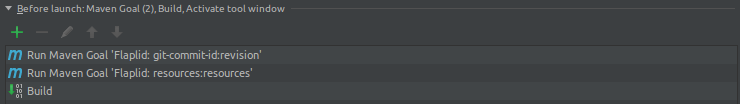

# Audit Shmaudit

foo

## Checks

This section describes the different check types you can use in your `config.yml`.

### AWS IAM
**Type**: aws_iam

### AWS Security Groups
**Type**: aws_security_groups

### GitHub Organization
**Type**: github_organization

### Slack Team
**Type**: slack_team

### Website Download
**Type**: website_download

### Website Link Target
**Type**: website_link_target

#### Description
This check is running a full browser in the background to load a given URL and click a link on the page. The URL of the new page loaded is compared against an expected target URL. An issue is raised if the URLs do not match.

#### Use-Case
Just like the *Website Link Download* check, this is a great way to prevent supply chain attacks. An attacker might change URLs on, for example, your download or documentation pages to trick a user into downloading a infected file or executing malicious code.

By running a full browser and not just parsing HTML, we simulate the full user behaviour. An attacker cannot intercept a click event using Javascript to redirect to a malicious page in the last moment. This check would catch these attempts to hide traces.

Source and destination page screenshots and copies of the source code can be optionally stored for later forensics.

#### Example configuration

This configuration clicks on the 4th element under the `.downloads .btn` CSS selector result and expects it to load a new page with the url `http://docs.graylog.org/en/2.3/pages/installation/operating_system_packages.html`. Screenshots and source code of both the source and destination page will be in case of a mismatch.

```
- type: website_link_target
  id: graylogorg-download-ova
  severity: emergency
  enabled: false
  url: http://www.graylog.org/download
  css_selector: ".downloads .btn"
  css_selector_index: 4
  expected_target: http://docs.graylog.org/en/2.3/pages/installation/operating_system_packages.html
  archive_mismatches: true
  archive_matches: false
```

## Local development

### Getting an IDE to correctly build the version and git information

We show version and build information during startup:

> 18:38:40.299 [main] INFO Main - Version: 0.1-SNAPSHOT built at [2017-12-24T17:38:36Z] from [d5af363-dirty].

The required information is built by maven during the final release and packaging step, but probably not by your IDE. Tell your IDE to execute the required maven goals before each local build like this in, for example, IntelliJ IDEA:



The maven goals are:

* `git-commit-id:revision`
* `resources:resources`
